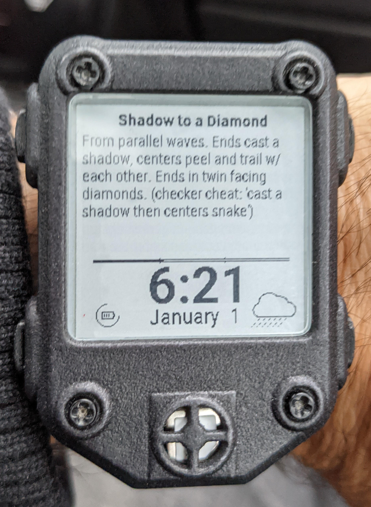

Watchy C4 face
==============

This is a
[C4 square dance](https://en.wikipedia.org/wiki/Challenge_square_dance)
([video](https://www.youtube.com/watch?v=V38pVxGHWwU)) flash card
watch face, with a CO₂ level monitoring function.  The flash card
portion is a port of a
[pebble watch face](https://github.com/cscott/pebble-c4).

The CO₂ level requires installing the CO₂ sensor as described in
[cscott/watchy-co2-pcb](https://github.com/cscott/watchy-co2-pcb#readme).
When you've done that, you might want a case:
[cscott/watchy-co2-case](https://github.com/cscott/watchy-co2-case#readme).

